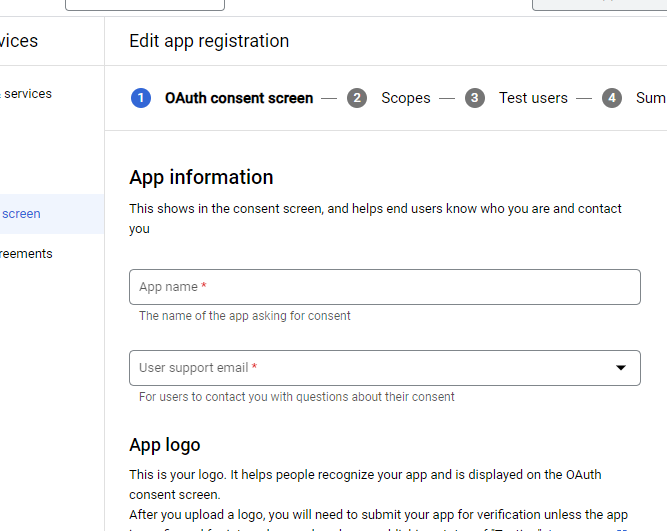
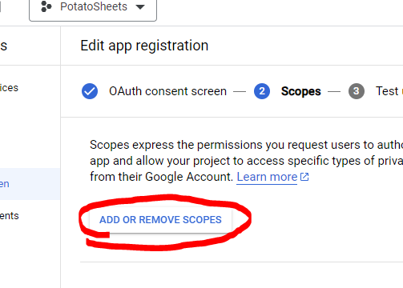
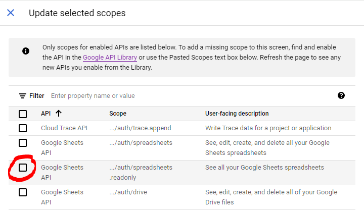
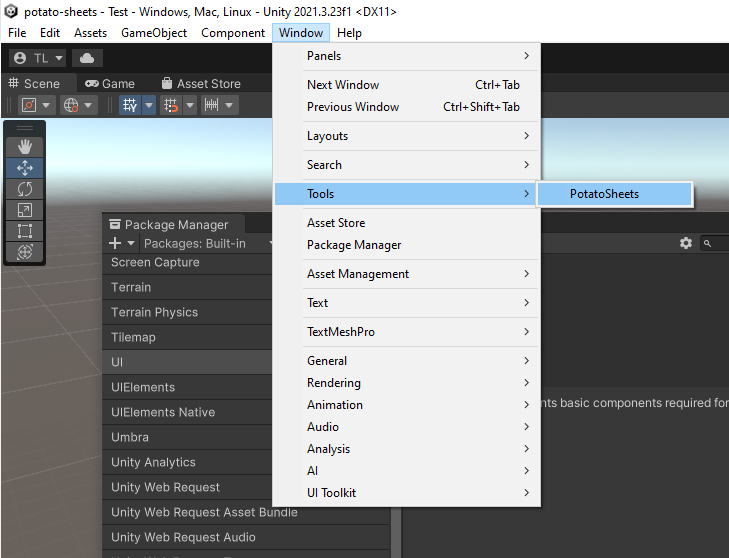
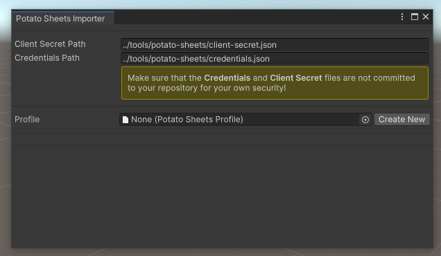

# potato-sheets
A light-weight Google Sheets importer for Unity scriptable objects

| Package Name | Package Version | Unity Version |
|-----|-----|-----|
| com.potatointeractive.sheets | 1.0.0 | 2021.3.x |

[Changelog](CHANGELOG.md)

# Overview
_PotatoSheets_ is an open source (MIT License) Google Sheets importer for Unity meant to quickly download data from Google Spreadsheets into your own Scriptable Objects data from the Editor to be used by your project at runtime.

## Key Benefits of this Package
* _PotatoSheets_ is configurable to each organization's _Google Cloud_, meaning that you can supply your own **Client Secrets** and restrict usage of the importer to people within your organization.
  * A detailed installation guide to set up _Google Cloud_ is provided in the **Installation** section.
* With both _Automatic_ and _Manual_ import types, engineers can customize as much or as little with how your data is created.
  * An explanation of the difference between and uses of both _Automatic_ and _Manual_ imports are in the **Usage** section.
* _PotatoSheets_ **does not** have dependencies on Google's hefty NuGet libraries/.dlls or Newtonsoft.Json (both of which can cause conflicts with other packages) or any plugins and instead opts to use Google's REST API to manually handle importing.
  * The only dependencies for this package are as follows:
    * `com.unity.editorcoroutines` `1.0.0`
    * `com.unity.textmeshpro` `3.0.6`
    * `com.unity.ugui` `1.0.0`
    * `com.unity.modules.jsonserialize` `1.0.0`
    * `com.unity.modules.imgui` `1.0.0`
    * `com.unity.modules.ui` `1.0.0`
    * `com.unity.modules.uielements` `1.0.0`
    * `com.unity.modules.uielementsnative` `1.0.0`
    * `com.unity.modules.unitywebrequest` `1.0.0`

# Installation

## OpenUPM
This project is available as an Open UPM Package: [](https://openupm.com/packages/com.potatointeractive.sheets/)

Visit [Open UPM](https://openupm.com) to learn more about the Open Unity Package Manager project and how to install the package in your Unity Project.

## Google Cloud
In order for _PotatoSheets_ to interface with Google's Sheets API, you need to have a Google account with a _Google Cloud_ configuration. Following are instructions on how to set up _Google Cloud_ to work with _PotatoSheets_.

### Sign-In and First Time Setup
1. Access `https://console.cloud.google.com/` and sign in with a Google Account
   * You will be prompted to accept their terms and conditions
   
2. Select **APIs & Services** > **Enabled APIs & Services**
   
3. Choose **Select a Project**
   
4. Choose **Create New Project**
   
5. Make a name for your new project. _PotatoSheets_ should work fine.
   * If you have permission from your admin(s) or pay for an organization, select it for the **Location** field (otherwise, leave it as **No Organization**)
   
6. Press **Create** and the project will take a moment to be created

### Enable Google Sheets API
1. Once redirected or by accessing the **Enabled APIs & Services** section, click **ENABLE APIS AND SERVICES**
   
2. From the **API Library**, search for `Google Sheets`
3. Select the **Google Sheets API**
4. Click **Enable** to enable the API

### Configure OAuth Consent Screen
1. Select **OAuth consent screen** from the **APIs & Services** menu, then choose your **User Type**
   * If you have an organization, you should select **Internal**, as it is likely you'll only be using _PotatoSheets_ internally
   * If you don't have an organization, you can still use _PotatoSheets_ by selecting **External** and manually add accounts that can access this project. Your app will most likely always remain in testing mode and not need to be verified.
   
2. Click **Create**
3. Enter in an **App name** (_PotatoSheets_ should work fine), a support email (likely your own or your group/company's support email address), and enter the same email for the developer contact information
   
4. Click **SAVE AND CONTINUE** at the bottom
5. Next, you will be adding *Scopes*. Click **ADD OR REMOVE SCOPES**
   
6. Page through the scopes and find the **Google Sheets API** and select the `../auth/spreadsheets.readonly` option
   
7. Click **UPDATE** at the bottom of the Scopes menu
8. Click **SAVE AND CONTINUE** of the Edit app registration page
9. Next, you will be adding *Test Users*. Click **ADD USERS** and enter any google email addresses that will need to use PotatoSheets
    * This step may look different or not exist(?) if you selected **Internal** in Step 1 of this section
10. Click **SAVE AND CONTINUE**

### Credentials Setup
1. Select **Credentials** from the **APIs & Services** menu, then click **Create Credentials** > **OAuth client ID**
   
2. Select **Desktop app** from the dropdown selection menu and name it (_PotatoSheets Client_ is fine)
3. Click **CREATE**
4. Download the **Client secret** JSON file by clicking **DOWNLOAD JSON**
   * This option can also be selected by clicking on the *OAuth 2.0 Client IDs* link and clicking the **DOWNLOAD JSON** button
6. Place your downloaded JSON file in your project folder under `project-name/tools/potato-sheets/` and rename it to `client-secret.json`
   * the folder `tools` should be in the same directory as your project's `Assets` folder
   * **NOTE:** you will want to make sure each user downloads this client secret file individually and NOT commit it to source control

# Usage

Before you can import any data, you need to create a data class that inherits from `ScriptableObject` and add the `ContentAsset` attribute to it. `ContentAsset` requires two arguments: **ImportType** and **PrimaryKey**
```csharp
using PotatoSheets;
using UnityEngine;

[ContentAsset(ImportType.Automatic, "primaryKey")]
public class MyDataClass : ScriptableObject {

}
```
Your **ImportType** options are *Automatic* and *Manual*, and you primary key will be the 'field name' of the identifying column of your data on your spreadsheet (such as `"id"`, `"key"`, etc). For *Automatic* imports, the primary key value will become the name of your imported asset, so it is good practice to include the type of data in your primary key (such as `Enemy_Cougar` or `Spell_Fire1`)

## Automatic Importing
*Automatic* importing is relatively simple; after you've created your class, all you need to do is mark up your fields or properties with the `Content` attribute.

Consider this example data...


...could look something like this in code:
```csharp
using PotatoSheets;
using UnityEngine;

[ContentAsset(ImportType.Automatic, "id")]
public class EnemyData : ScriptableObject {

  [Content("name")]
  public string Name;

  [SerializeField]
  [Content("health")]
  private int m_health;

  [Content("atk")]
  [Content("attackMultiplier")]
  public float AttackMultiplier;
}
```
String parameters in the `Content` attribute would be the name of the column in GoogleSheets that the data will be read from. It is valid to have multiple `Content` attributes for a field, in case different worksheets use different column titles. The furthest column to the right will usally be the one that 'wins' if there are multiple columns in the same worksheet per field/property.

### Supported Automatic Import Field/Property Types
Currently, Lists and Dictionaries (or any other Generic Collections) are not supported for *Automatic* importing. However, you can support them yourself with *Manual* importing if you need to handle them.
| Group | Types |
|-----|-----|
| System Structs | `string` `int` `uint` `short` `ushort` `long` `ulong` `byte` `sbyte` `char` `float` `double` `decimal` `DateTime` |
| Unity Structs | `Vector2` `Vector3` `Vector4` `Vector2Int` `Vector3Int` `Bounds` `BoundsInt` `Rect` `RectInt` `Color` `Color32` |
| Unity Classes | *`UnityEngine.Object` `ScriptableObject` |
| Enums | `int` `uint` `short` `ushort` `long` `ulong` `byte` `sbyte`|
| User Structs and Classes | requires a constructor with `string` parameter |


## PotatoSheets Window
Because the `com.potatointeractive.sheets` package is installed in your project, you can access the _PotatoSheets_ window from Unity by selecting **Window** > **Tools** > **Potato Sheets**


If this is your first use, it should look something like this:


### Import Profile Setup
1. Press the **Create New** button next to the *Profile* object selector.
   * Feel free to rename the newly created profile asset and place it in any folder you wish
2. You will see the **Profile List** appear
   * The **Profile List** will only appear when you have selected a valid **PotatoSheetsProfile** object
3. Press the **+** button next to **Profile List** to add a new profile
   * The **Profile Settings** will appear when you have selected a *Profile* from the **ProfileList**
   * Selected *Profiles* can be removed by pressing the **-** button next to **Profile List**
4. Now you can set information for the importer to import your content
   | Field | Usage |
   |-----|-----|
   | Profile Name | The name of the profile as it will appear in the **Profile List** |
   | SheetID | The unique id of your Google Spreadsheet in Google Drive. The id can be located by opening the spreadsheet and reading the url between the `d/` and `/edit/` section. |
   | Worksheet Name | This is the name of the sheet _within_ your spreadsheet that you will be importing. The name is located at the bottom of the screen when viewing a spreadsheet. |
   | Asset Type | A comprehensive list of all ScriptableObject classes in your project that have the `[ContentAsset]` attribute. This will be the type used to create data when this profile is imported. |
   | Asset Directory | The path relative to your project folder where assets will be created on import. |
5. After you have configured a *Profile*, you can import it by clicking the **Import** or **Import All** buttons

